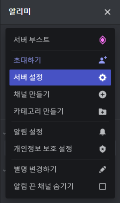
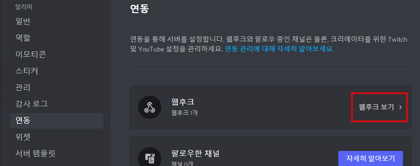
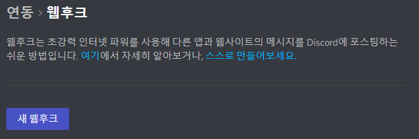
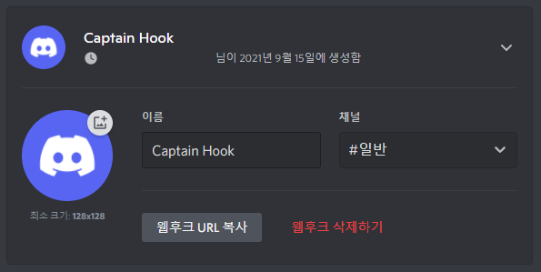
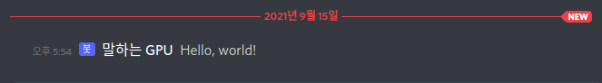

# Speaking GPU for monitoring your experiments


## Quick start

Clone this repository and install it.
```bash
git clone https://github.com/sanghyun-son/speaking-gpu.git
cd sg_bot
python setup.py develop
```

Then, make a webhook in your discord server.

**Step 1**



**Step 2**



**Step 3**



**Step 4**



You can set the bot name and image. Check `asset/rtx.png`. Copy the url from this step.


Place authentication file in the root directory.
```bash
cd
# You are under /home/[username]/.
mkdir auth
cd auth

# You are under /home/[username]/auth
vi url.txt
[Paste your server url]

home
|-- [username]
|   |-- auth
|   |   `-- url.txt
|   |
|   `-- ...
|
`-- ...
```

Call the bot inside your training script!
```python
from speaking_gpu import bot

sg_bot = bot.SpeakingGPU(prefix='')
sg_bot.send('Hello, world!')
# You can force the notification
sg_bot.send('Hello, world!', force_notification=True)
```


